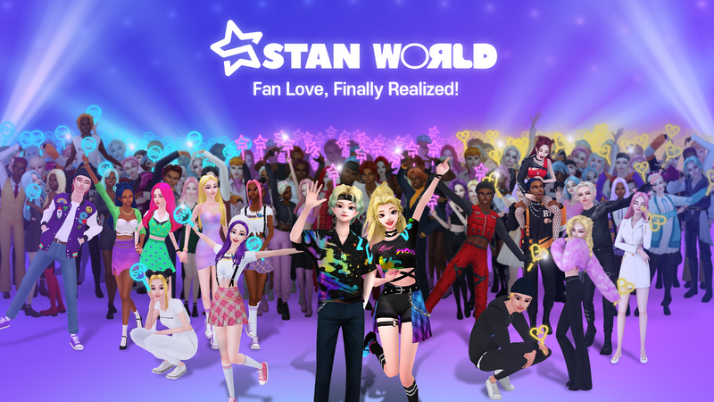

# About Eunkyu 👋

## **I Am:**

- 👨🏽‍💻 A **business-savvy** builder with experience in co-founding, pivots, M&As, restructuring, and growth.
- 🌱 A senior software engineer **(6+ years)** fluent in various languages and frameworks.
- 👑 Extremely passionate about products leveraging **next-gen technologies** to revolutionize how we live, work, and build relationships (e.g. AI, metaverse, blockchain, no-code, automation).
- ⚡️ A **lightspeed learner** absorbing up-to-date technologies & an **entrepreneur** thriving on challenges.
- 🦾 Capable in both building **from scratch** and enhancing **existing structures**.
- 🤹 **Multicultural** and multilingual, speaking Korean, English, and Spanish.
- 📫 How to reach me: choi2nkyu@gmail.com.

## **Work Experience:**

<!-- Avalanche -->

 

### Ava Labs
**AvaCloud Sr. Solutions Engineer** *(Apr 2024 - Current)*

Road to Solutions Engineer - AvaCloud

**Delivering Business Value**
- Collaborates with Ava Labs' business development team, attending client meetings to help close deals and onboard new partners by providing technical insights on AvaCloud’s blockchain-as-a-service (BaaS) platform.
- Developed the "Balance Checker" tool to monitor gas relayer wallet balances, sending automated Slack alerts when balances are low to ensure clients can maintain adequate funds.

**Key Contributions**
- Serves as the main point of contact between Ava Labs’ engineers and clients, ensuring technical solutions meet business needs.
- Facilitates communication between Korean client partners and non-Korean solution engineers to streamline support.

**Tech Stack**
- Slack API, Go, AvaCloud, Blockchain technologies, Hubspot

<!-- CATE -->

 

### CATE Corp.
**CTO(Interim)** *(Jul 2023 - Feb 2024)*

Pivot to Generative Agents - Artmate

**Delivering Business Value**
- Restructured the engineering team by 60% while maintaining speed, decreasing cost (e.g. AWS by 50%), and transforming it into a growth team.
- Pivoted the UGC platform to an AIGC platform for growth.
- Developed the prototype within 2 months for the CEO to fundraise.

**Key Contributions**
- Led engineering while collaborating with AI research advisors in Silicon Valley every week.
- Designed the system architecture for Artmate so that the users can find their “taste” in art/exhibitions using chat rather than conventional search or discover.
- Developed a modular backend server (currently integrated with the OpenAI API) which can be replaced easily with other LLMs (in consideration of exits and pivots).

**Tech Stack**
- OpenAI, React, React Native, Expo, Node.js, Nest.js, Java, Kafka, MongoDB, AWS, Docker, Github

<!-- Stan World -->

 

### Stan World Inc.
**CTO(Interim)** *(Jan 2023 - Jul 2023)*, 
**Software Engineer** *(Jul 2022 - Dec 2022)*

Automation - StanBot

**Delivering Business Value**
- Developed StanBot, saving 40 hours/week in manual work.
- Automated Daily Rank system, streamlining integration with the 3D app.

**Key Contributions**
- Created a Node.js script for daily tasks: Twitter counts, leaderboard images, database updates, and cloud storage archiving (S3).
- Efficiently replaced manual steps in Daily Ranking with a code on a scheduler.
- Tested & quantified Twitter count sources: Manual, Twitter API, and Talkwalker API.
- Used Google Sheets as an intuitive web admin tool for non-developers, controlling events and styles.

**Tech Stack**
- Node.js, Express.js, AWS, Google Sheets, Redis, HTML, OUTCODE, Github

Web3 Incorporation - Blockchain

**Delivering Business Value**
- Seamlessly integrated blockchain to enable token earning, staking, and voting for community engagement.

**Key Contributions**
- Developed a Solana-based server using Node.js for the 2022 Solana Summer Hackathon entry. (3 weeks)
- Created an Avalanche-based server using Node.js, demonstrating rapid proof-of-concept. (1.5 months)
- Revamped the Avalanche-based server using Go, enhancing compatibility and support for Avalanche with voting features. (2.5 months)
- Swiftly absorbed and mastered Web3 terminology and concepts. (2 weeks)
- Collaborated with the Avalanche DevOps team to resolve critical dependency build errors.
- Invited as a presenter at the Avalanche Seoul Builders Meetup to discuss the successful integration of Web3 in a GenZ female-focused platform.

**Tech Stack**
- Node.js, Express.js, AWS, Amazon RDS, Go, Github

<!-- Outcode -->

 

### Powertask Inc.
**Software Developer** *(Jan 2021 - Jul 2022)*

Dataflow (feature of OUTCODE)

**Delivering Business Value**
- Developed the backend of Dataflow, the feature for task automations
- Automated multi-step tasks: trigger + app plugins + actions

**Key Contributions**
- Integrated 25 third-party apps as plugins, connecting the core server to their APIs or Node packages.
- Rewrote the entire backend while maintaining compatibility with the frontend and core server.
- Implemented AWS KMS for enhanced security in storing user data.
- Developed a recurring payment system using Payple, Toss, and PayPal.
- Created a scheduler to trigger all user-set dataflows.
- Integrated CI using Node scripts and Docker.

**Tech Stack**
- Node.js, Express.js, AWS, MySQL, MongoDB, Github, Docker

Databoard - OUTCODE Platform

**Delivering Business Value**
- Developed the backend of Databoard, the feature for data visualization.
- Centralized data from different sources, allowing actions on them.

**Key Contributions**
- Designed, architected, and developed Databoard features and data structure, collaborating with a front-end developer.
- Developed a dashboard to view list of databoards, contributors and status.
- Developed access control feature for organizations and users.
- Abstracted action layer for seamless execution in the same core as Dataflows.

**Tech Stack**
- Node.js, AWS, MySQL, MongoDB, Github, Docker

<!-- Thomson Reuters -->

 

### Thomson Reuters
**Software Engineer** *(Feb 2018 - Jun 2020)*

Aumentum Registry for Lagos

**Delivering Business Value**
- Developed a new web client app.
- Updated the existing web admin panel & desktop app for new business requirements.

**Key Contributions**
- Developed the web client's components for the MVP launch.
- Worked with a senior software engineer to refactor server APIs for readability and reusability.
- Developed and performed automated load testing to help server engineers to find memory leakage.
- Migrated older UX packages into Thomson Reuter's frontend frameworks.
- Defined workflows with the business team to set business logic.

**Tech Stack**
- Angular, Java, C#, SQL Server, TFS, JMeter, Azure DevOps

## **Languages and Tools:** 

  <code></code>
  <code></code>
  <code></code>
  <code></code>
  <code></code>
  <code></code>
  <code></code>
  <code></code>
  <code></code>
  <code></code>
  <code></code>
  <code></code>
  <code></code>
  <code></code>
  <code></code>
  <code></code>
  <code></code>

<!-- This readme was originally created by Murillo Comino - https://github.com/onimur and modified by Eun Kyu Choi - https://github.com/choi2nkyu -->
